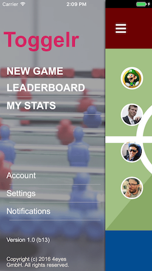
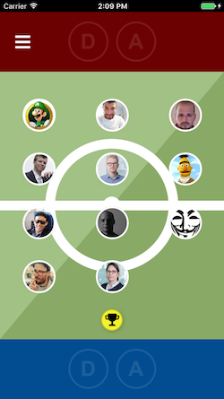
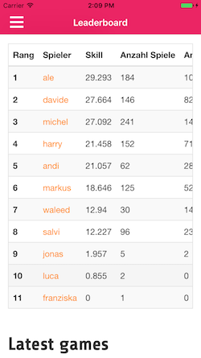

# Toggelr
Toggelr is an iOS app used to track and record foosball games

It features currently
- Add new foosball game record by drag and drop players
- Show sophisticated statistics as a leaderboard. Skill and other statistics are calcalulated after each new game on server side. 

Planned features
- Account and teams to support multiple locations 
- Widget / Watch app
- Siri integration

## Getting Started

These instructions will get you a copy of the project up and running on your local machine for development and testing purposes. See deployment for notes on how to deploy the project on a live system.

### Prerequisites

The toggelr webservice. http://toggelr.4eyes.ch
- Teams and accounts are available soon and you will be able to register your own team
- Self hosting not supported (yet)

### Installing

The app is not yet in the app store. If you're interested to get a pre-release please get in touch with us info-at-4eyes.ch

## System Requirements

iOS 9.3 +

## Contributing

Please feel free to submit pull requests

## Authors

* **Michel Georgy** - [MichelGeorgy](https://github.com/MichelGeorgy)

## License

This project is licensed under the MIT License - see the [LICENSE.md](LICENSE.md) file for details